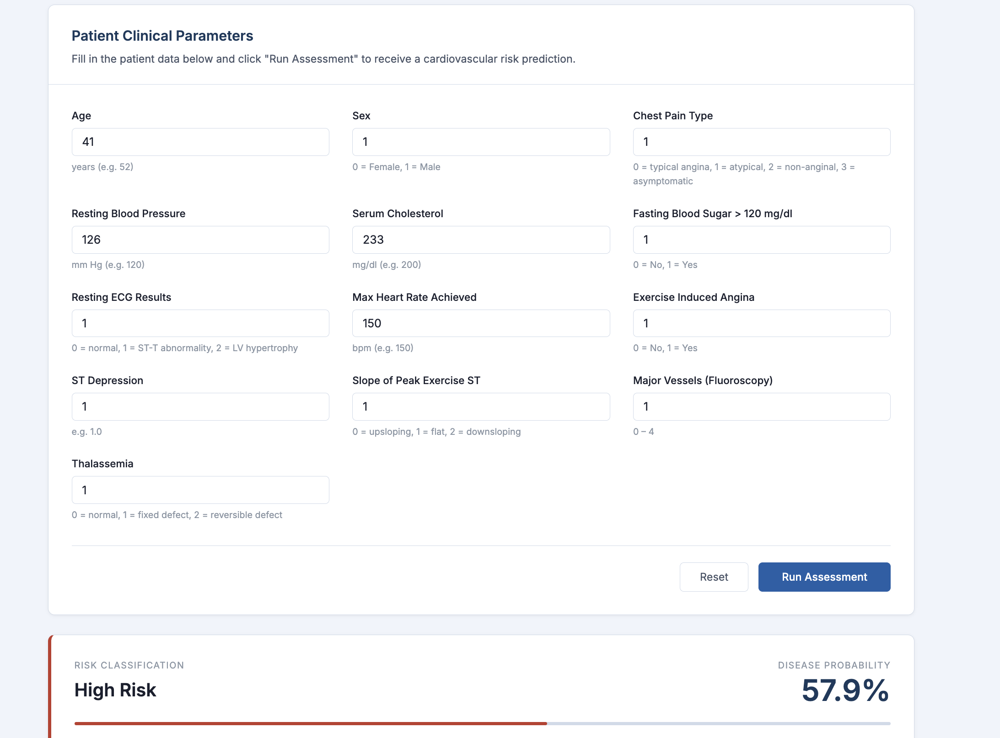
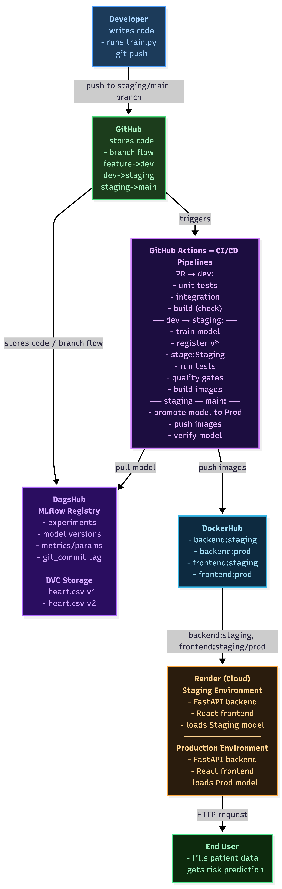
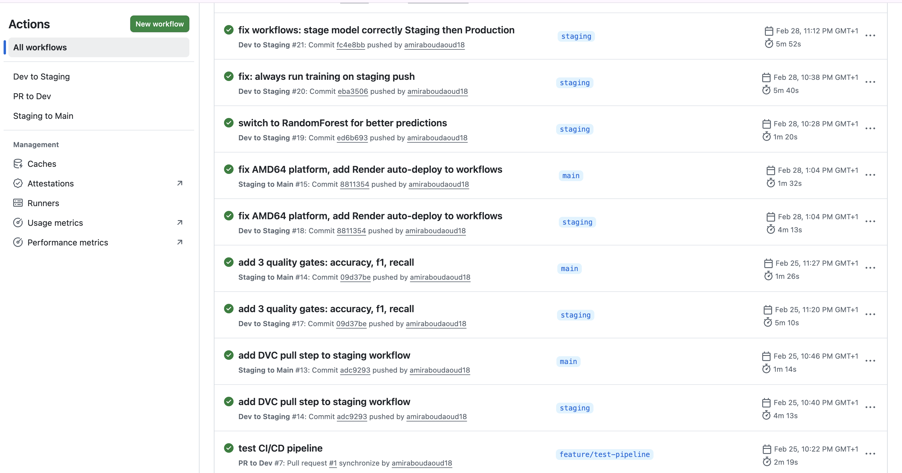

# Heart Disease Predictor — MLOps Pipeline

A production-grade MLOps project that trains, versions, and deploys a heart disease risk prediction model with a fully automated CI/CD pipeline, model registry, and cloud deployment.

**Live Application:** https://heart-disease-detector-twrr.onrender.com

**GitHub Repository:** https://github.com/amiraboudaoud18/heart-disease-predictor

**DagsHub / MLflow Tracking:** https://dagshub.com/amiraboudaoud18/heart-disease-predictor


---

## Table of Contents

- [Project Overview](#project-overview)
- [Dataset](#dataset)
- [Architecture](#architecture)
- [Tech Stack](#tech-stack)
- [Project Structure](#project-structure)
- [CI/CD Pipeline](#cicd-pipeline)
- [Testing](#testing)
- [Model Promotion Pipeline](#model-promotion-pipeline)
- [Quality Gates](#quality-gates)
- [Environments](#environments)
- [Reproducibility Instructions](#reproducibility-instructions)
- [API Reference](#api-reference)

---

## Project Overview

This project predicts whether a patient is at high or low risk of heart disease based on 13 clinical features. The goal is not just to build a model, but to build the full MLOps infrastructure around it: data versioning, experiment tracking, model registry, automated testing, CI/CD pipelines, and cloud deployment.

The system follows a strict model lifecycle where every change goes through staging before reaching production, and the model registry (MLflow on DagsHub) serves as the single source of truth for what runs in production -  not whatever is in the repository.



---

## Dataset

The project uses the Cleveland Heart Disease dataset from the UCI Machine Learning Repository.

source dataset : https://www.kaggle.com/datasets/johnsmith88/heart-disease-dataset

**Features used for prediction:**

| Feature | Description |
|---|---|
| age | Age of the patient |
| sex | Sex (1 = male, 0 = female) |
| cp | Chest pain type (0-3) |
| trestbps | Resting blood pressure (mm Hg) |
| chol | Serum cholesterol (mg/dl) |
| fbs | Fasting blood sugar > 120 mg/dl (1 = true) |
| restecg | Resting ECG results (0-2) |
| thalach | Maximum heart rate achieved |
| exang | Exercise induced angina (1 = yes) |
| oldpeak | ST depression induced by exercise |
| slope | Slope of peak exercise ST segment |
| ca | Number of major vessels colored by fluoroscopy (0-3) |
| thal | Thalassemia type (0-3) |

**Target:** 0 = Low Risk, 1 = High Risk

### Data Versioning with DVC

The dataset is versioned using DVC with DagsHub as the remote storage. Two versions of the dataset were used during development:

- **v1** — 242 rows (initial dataset)
- **v2** — 303 rows (expanded dataset, currently in use)

This means every model version in MLflow has a traceable link to the exact data version that produced it, via the `dvc_data_version` tag recorded at training time.

---

## Architecture

<div align="center">
  
</div>

### Request Flow

```
User Browser
     |
     v
Frontend (React + Vite)
served by Nginx on Render
     |
     | HTTP POST /predict
     v
Backend (FastAPI + Uvicorn)
running on Render
     |
     | loads model at startup
     v
MLflow Model Registry (DagsHub)
models:/heart-disease-model/Production
     |
     v
RandomForest Model
returns prediction + probability
```

---

## Tech Stack

| Layer | Technology |
|---|---|
| ML Model | scikit-learn RandomForestClassifier |
| Experiment Tracking | MLflow on DagsHub |
| Data Versioning | DVC with DagsHub remote |
| Backend API | FastAPI + Uvicorn |
| Frontend | React + Vite |
| Containerization | Docker + Docker Compose |
| CI/CD | GitHub Actions |
| Container Registry | DockerHub |
| Cloud Deployment | Render (free tier) |
| Code Quality | Ruff + pre-commit hooks |

---

## Project Structure

```
heart-disease-predictor/
├── .dvc/                        # DVC configuration
├── .github/
│   └── workflows/
│       ├── pr-to-dev.yml        # PR validation pipeline
│       ├── dev-to-staging.yml   # Staging pipeline (train + test + deploy)
│       └── staging-to-main.yml  # Production pipeline (promote + deploy)
├── backend/
│   ├── app/
│   │   ├── main.py              # FastAPI application
│   │   ├── predict.py           # Model loading and inference
│   │   └── preprocess.py        # Data preprocessing
│   ├── tests/
│   │   ├── test_unit.py         # Unit tests (preprocessing)
│   │   ├── test_integration.py  # Integration tests (API endpoints)
│   │   └── test_e2e.py          # End-to-end tests (full flow)
│   ├── train.py                 # Model training and MLflow registration
│   ├── Dockerfile
│   └── requirements.txt
├── data/
│   └── heart.csv.dvc            # DVC pointer to actual data
├── frontend/
│   ├── src/
│   │   ├── App.jsx              # Main React component
│   │   └── App.css              # Styling
│   ├── Dockerfile
│   └── nginx.conf
├── .env.example                 # Environment variable template
├── docker-compose.yml           # Local development setup
└── pyproject.toml               # Python project config + pytest settings
```

---

## CI/CD Pipeline

Three GitHub Actions workflows automate the entire lifecycle from code change to production deployment.

### Workflow 1 — PR to Dev

**Trigger:** Pull request targeting the `dev` branch

**Purpose:** Validate every change before it reaches dev. Acts as the first quality checkpoint.

**Jobs:**
1. Run unit tests against preprocessing logic
2. Run integration tests against API endpoints
3. Build Docker images for both backend and frontend (no push — validation only)

This workflow ensures that no broken code ever reaches the `dev` branch.

### Workflow 2 — Dev to Staging

**Trigger:** Push to the `staging` branch

**Purpose:** Train a new model, deploy to staging, and validate it before production.

**Jobs:**
1. Pull data from DVC remote (DagsHub)
2. Train the model and register a new version in MLflow
3. Transition the new model version to **Staging** stage in MLflow
4. Run the full test suite (unit + integration + E2E)
5. Build Docker images and push to DockerHub with `:staging` tag
6. Run quality gates against the Staging model metrics
7. Trigger Render to redeploy the staging environment

If quality gates fail, the model remains in Staging stage and production is not affected.

### Workflow 3 — Staging to Main

**Trigger:** Push to the `main` branch

**Purpose:** Promote the validated staging model to production and deploy.

**Jobs:**
1. Promote the model from **Staging** to **Production** stage in MLflow
2. Tag the staging Docker images as `:production` and push to DockerHub
3. Build the production frontend with the production backend URL
4. Verify the Production model exists in MLflow registry
5. Trigger Render to redeploy the production environment




### Branch Strategy

```
feature/* --> dev --> staging --> main
                |         |          |
            PR pipeline  Staging    Production
                         pipeline   pipeline
```

All work starts on a feature branch and flows through dev, staging, and main. Direct pushes to staging and main are not recommended — changes should always flow through the branch hierarchy.


# Testing

The project includes three levels of automated testing, all executed as part of the CI/CD pipeline.

### Unit Tests

Test pure Python logic in isolation, without any external dependencies or running services.

**What is tested:**
- Feature scaling and normalization in `preprocess.py`
- Input validation — correct number of features, correct data types
- Output shape — preprocessed data returns the expected dimensions

Run locally:
```bash
cd backend
python -m pytest tests/test_unit.py -v
```

### Integration Tests

Test the API endpoints using FastAPI's test client, with the real model loaded from MLflow.

**What is tested:**
- `GET /health` returns correct status, environment, and model stage
- `POST /predict` with valid input returns a prediction and probability
- `POST /predict` with missing fields returns a 422 validation error
- `POST /predict` with invalid data types returns an appropriate error

Run locally:
```bash
cd backend
python -m pytest tests/test_integration.py -v
```

### End-to-End Tests

Test the full request flow from API input to prediction output, simulating real usage.

**What is tested:**
- A known low-risk patient profile returns prediction 0
- A known high-risk patient profile returns prediction 1
- Probability values are between 0 and 1
- Response time is within acceptable bounds

Run locally:
```bash
cd backend
python -m pytest tests/test_e2e.py -v
```

### Running the Full Test Suite
```bash
cd backend
python -m pytest tests/ -v
```

All three test levels run automatically in the `dev-to-staging.yml` workflow on every push to the staging branch.

---

## Model Promotion Pipeline

The model lifecycle follows a strict registry-based promotion flow. Production always serves a specific named version from the MLflow registry — never just "whatever is in the repository."

```
1. Training (local or CI)
   - Train RandomForest model
   - Log metrics, parameters, git commit, DVC data version to MLflow
   - Register as new version in MLflow (stage: None)

2. Staging transition (dev-to-staging workflow)
   - Transition new version to "Staging" stage in MLflow
   - Quality gates evaluated against Staging model

3. Production promotion (staging-to-main workflow)
   - Transition Staging model to "Production" stage
   - Archive previous Production versions
   - Backend loads models:/heart-disease-model/Production at startup

4. Rollback
   - To roll back: transition a previous version back to Production in MLflow
   - Backend will load the previous version on next restart
   - No code change required
```

### Model Lineage

Every model version in MLflow records:

- `accuracy`, `f1_score`, `precision`, `recall` — performance metrics
- `C`, `n_estimators`, `max_depth`, `random_state` — hyperparameters
- `git_commit` — the exact Git commit that produced this model
- `dvc_data_version` — the MD5 hash of the data version used for training
- `training_samples` — number of samples used

This means any model version can be fully reproduced by checking out the corresponding Git commit and pulling the corresponding DVC data version.


---

## Quality Gates

Before a model is eligible for production, it must pass three automated quality gates evaluated against the Staging model in MLflow:

| Gate | Metric | Threshold |
|---|---|---|
| Accuracy | Overall correctness | >= 0.75 |
| F1 Score | Balance of precision and recall | >= 0.75 |
| Recall | Sensitivity — ability to catch true positives | >= 0.70 |

Recall is particularly important in a medical context because a false negative (missing a sick patient) is more dangerous than a false positive (flagging a healthy patient).

If any gate fails, the workflow exits with a non-zero code, the model stays in Staging, and the staging-to-main merge is blocked.

**Current Production Model Performance (v6 — RandomForest):**

| Metric | Value |
|---|---|
| Accuracy | 86.89% |
| F1 Score | 87.88% |
| Recall | 90.62% |

---

## Environments

The project runs across three environments:

| Environment | Frontend URL | Backend URL | Model Stage |
|---|---|---|---|
| Local development | http://localhost:5173 | http://localhost:8000 | Production |
| Staging | heart-disease-detector-staging.onrender.com | heart-disease-backend-staging.onrender.com | Staging |
| Production | heart-disease-detector-twrr.onrender.com | heart-disease-backend-production.onrender.com | Production |

Environment variables are never committed to the repository. Local development uses a `.env.development` file (gitignored). Production and staging secrets are injected at runtime through Render's environment variable configuration.

---

## Reproducibility Instructions

### Prerequisites

- Python 3.11+
- Node.js 20+
- Docker Desktop
- Git

### Local Setup

**Step 1 — Clone the repository:**

```bash
git clone https://github.com/amiraboudaoud18/heart-disease-predictor.git
cd heart-disease-predictor
```

**Step 2 — Create a Python virtual environment:**

```bash
python3 -m venv venv
source venv/bin/activate
pip install -r backend/requirements.txt
pip install dvc pytest httpx pre-commit
```

**Step 3 — Install pre-commit hooks:**

```bash
pre-commit install
pre-commit install --hook-type pre-push
```

**Step 4 — Configure environment variables:**

```bash
cp .env.example .env.development
```

Open `.env.development` and fill in the values:

```
MLFLOW_TRACKING_URI=https://dagshub.com/amiraboudaoud18/heart-disease-predictor.mlflow
MLFLOW_TRACKING_USERNAME=your_dagshub_username
MLFLOW_TRACKING_PASSWORD=your_dagshub_token
MODEL_NAME=heart-disease-model
MODEL_STAGE=Production
ENVIRONMENT=development
FRONTEND_URL=http://localhost:5173
```

**Step 5 — Pull the data from DVC:**

```bash
dvc remote modify origin --local auth basic
dvc remote modify origin --local user YOUR_DAGSHUB_USERNAME
dvc remote modify origin --local password YOUR_DAGSHUB_TOKEN
dvc pull
```

**Step 6 — Run the tests:**

```bash
cd backend
python -m pytest tests/ -v
```

**Step 7 — Train the model locally:**

```bash
cd backend
python train.py
```

This will train a new RandomForest model, log all metrics and artifacts to MLflow on DagsHub, and register a new version in the model registry.

**Step 8 — Start the backend:**

```bash
uvicorn app.main:app --reload --port 8000
```

**Step 9 — Start the frontend:**

```bash
cd frontend
npm install
npm run dev
```

The application will be available at http://localhost:5173.

### Running with Docker Compose

To run the full stack locally using Docker:

```bash
docker-compose up --build
```

- Frontend: http://localhost:3000
- Backend: http://localhost:8000

### Contributing

All contributions must go through the branch flow:

```bash
git checkout dev
git pull origin dev
git checkout -b feature/your-feature-name

# make your changes

git add .
git commit -m "describe your change"
git push origin feature/your-feature-name
```

Then open a pull request from your feature branch to `dev` on GitHub. The PR pipeline will run automatically. If all checks pass, the PR can be reviewed and merged.

---

## API Reference

### GET /health

Returns the current status of the service and the loaded model information.

**Response:**

```json
{
  "status": "ok",
  "environment": "production",
  "model_stage": "Production",
  "model_name": "heart-disease-model"
}
```

### POST /predict

Accepts 13 patient features and returns a risk prediction.

**Request body:**

```json
{
  "age": 63,
  "sex": 1,
  "cp": 3,
  "trestbps": 145,
  "chol": 233,
  "fbs": 1,
  "restecg": 0,
  "thalach": 150,
  "exang": 0,
  "oldpeak": 2.3,
  "slope": 0,
  "ca": 0,
  "thal": 1
}
```

**Response:**

```json
{
  "prediction": 1,
  "label": "High Risk",
  "probability": 0.7699
}
```

`prediction` is 0 for Low Risk and 1 for High Risk. `probability` is the model's confidence score for the positive (High Risk) class.
